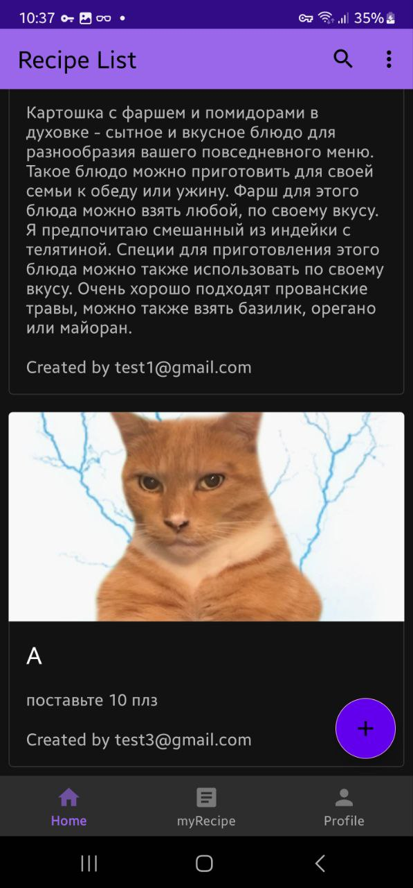

# Recipes App 

Recipes by Avgustin is a convenient mobile application for all things, developed by Avgustin for situational tasks #2. With this app, you can easily discover, save, and share your favorite recipes/ideas.

# Key features
- Recipe search: Find recipes by name, ingredients, or type/form.
- Save Favorite Recipes: Keep track of recipes you add for easy access later on.
- Check and Share with other people recipes: You can share your recipes with everyone.

# Getting Started
- First, create firebase auth, firestore, database then connect them(console.firebase.google.com)
- Run gradle options, sync and run project.
- That's all.

## Screens

  
  
  
  
  
  
  
  
  
  

## Firebase'

  
  
  

## Tools
- Kotlin
- Firebase (auth,firestore,database,analytics)
- API

## Credit
[Avgustine](https://github.com/NPaugust)
